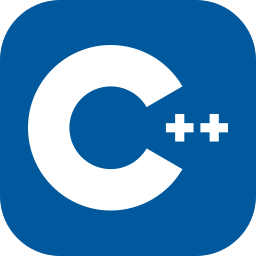

<div align="center">
    
<h1>MKGEN <em>a C/C++ Makefile generator</em></h1>

[](https://www.python.org/downloads)
[](https://pypi.org/project/rich/)
[](https://pypi.org/project/Jinja2/)
<a href="https://github.com/gtRZync/mkgen/blob/main/LICENSE">
    
</a>
</div>

<div align="center"><b>Zero-pain</b> Makefiles for C and C++ projects</div>

## Supported languages

<div>
    
    
</div>

## Supported graphics libraries

<div>
    
    
    
</div>

## Supported platforms

<div>
    
    
    
</div>


## About mkgen

**mkgen** is a lightweight **Makefile generator** designed for my everyday C and C++ workflow.

I often start with a *small* C or C++ file. Then it grows. Suddenly there are multiple `.c` / `.cpp` files, header files, and sometimes a graphical library involved. At that point, compiling manually or rewriting a Makefile becomes repetitive and annoying.

So I built **mkgen**.

It’s written in **Python** and focuses on **C and C++ projects**, with optional support for graphical libraries when needed.

---

## Why mkgen?

* I like coding in **C and C++**
* Small projects tend to grow faster than expected
* Writing Makefiles over and over is tiring
* Linking multiple source files and libraries manually is error‑prone

mkgen automates the boring part so I can focus on writing code.

---

## Features

* Automatically generates a **Makefile** for C and C++ projects
* Detects multiple source files and header files in a deterministic way using anchor files
* Supports both **C** and **C++** compilation
* Designed to scale from tiny projects to larger ones
* Optional support for **graphical libraries**
* Simple and minimal by design

---

## Philosophy

mkgen is not meant to replace advanced build systems like CMake or Meson.

It is meant to be:

* **Simple**
* **Fast**
* **Opinionated toward C/C++**
* Easy to understand and modify

It exists because *I needed it*.

---

## Requirements

* Python 3.11+
* A C compiler (`gcc`, `clang`, etc.)
* or a C++ compiler (`g++`, `clang++`)
* `make` using posix environement on windows (msys2, git bash...etc)

---

## Installation

1. Clone the repository:

```sh
git clone https://github.com/gtRZync/mkgen.git
```

```sh
cd mkgen
```

2. Install globally for convenience:

```sh
pip install .
```

## Quick Start

Assuming `MyProject` is an existing C or C++ project:

```sh
cd MyProject
```

Create anchor files to identify your project's modules and public include directories:

```sh
touch src/.module
touch src/entity/.module
touch src/objects/.module

touch include/.public
touch include/entity/.public
touch include/objects/.public
```

Initialize the project configuration:

```sh
mkgen init .
```

Edit `mkgen.toml` to match your project's requirements.

Generate the Makefiles:

```sh
mkdir -p build
mkgen generate --root . --build-dir build
```

Build the project:

```sh
mkgen build --build-dir build --target run --parallel 12
```

> [!NOTE]
>
> After the initial `generate`, structural changes (such as adding or removing modules or source files) are detected automatically by `mkgen build`, which regenerates the necessary generated files before invoking `make`.

## Commands

### `init`

Creates a mkgen.toml template in the project root.

**Usage**

```bash
mkgen init <ROOT-DIR>
```

### Required positional argument

| Argument          | Description                   |
|-------------------|-------------------------------|
| `root`            | The project source directory. |

### Optional arguments

| Argument             | Description| Default  |
| -------------------- | -----------| -------- |
| `--force` | Force config file generation if exists. | False     |
| `-h`, `--help` | show an help message and exit |


### `generate`

Generate a Makefile based on the current project's config.

**Usage**

```bash
mkgen generate [<options>]
```

### Required arguments

| Argument          | Description                                                                                 |
|------------------|---------------------------------------------------------------------------------------------|
| `--root`   | The project source directory. |
| `--build-dir`   | Directory where mkgen generates build files (including the Makefile). |

### Optional arguments

| Argument             | Description| Default  |
| -------------------- | -----------| -------- |
| `-l`, `--language`   | Specify the programming language to use. Supported: `C` or `C++`.| None     |
| `-c`, `--compiler`   | Specify the compiler to use. This value will be written into the generated Makefile. | None     |
| `-std`, `--standard` | Specify the language standard to use (e.g., c11, c17, c++11, c++17, c++20). | None     |
| `--gui`    | Include GUI library flags in the Makefile. Supported backend: `SDL2`, `SFML`, `RAYLIB`. | None     |
| `--app-name` | Specify the name of the output binary/executable. | None     |
| `--force` | Force makefile generation if exists | False     |
| `-h`, `--help` | show an help message and exit |

---


### `build`

Builds the project using make under the hood.

**Usage**

```bash
mkgen build [<options>]
```

### Required argument

| Argument        | Description                                                          |
|-----------------|----------------------------------------------------------------------|
| `--build-dir`   | Directory where mkgen generates build files (including the Makefile).|

### Optional arguments

| Argument             | Description| Default  |
| -------------------- | -----------| -------- |
| `--parallel` | Indicate how many jobs make should run. | False     |
| `--target` | Makefile recipe to build. | None     |
| `-h`, `--help` | show an help message and exit |

---

### `version`

Display mkgen's current version.

**Usage**

```bash
mkgen version
```

> [!NOTE]
> The version command is equivalent to running `mkgen --version`.<br>

---

## Shared Command Options

| Flag            | Description                         |
|-----------------|-------------------------------------|
| `--banner`      | Show ASCII banner                   |
| `--no-banner`   | Disable ASCII banner                |

## Global Options

| Flag              | Description                        |
|-------------------|------------------------------------|
| `-v`, `--version` | Print version information and exit |
| `-h`, `--help`    | Show help and exit                 |

---

## Usage examples:

### Default

```sh
mkgen generate --root . --build-dir build/
```

> [!NOTE] 
>
> Uses mkgen config file (mkgen.toml)
>
> A template of this file can be generated using the init command.

### Using cli overrides

> [!CAUTION]
> Not wired yet.

```sh
mkgen generate --root . \
    --build-dir build/ \
    --lang C++ \
    -c clang++ \
    -std c++17 \
    --gui=SDL2 \
    --app-name my_app
```

```sh
mkgen generate --root . \
    --build-dir build/ \
    -l C \
    -std c23 \
    -c gcc
```

## Status

This is a personal tool built for real projects. Features may evolve as my workflow evolves.

